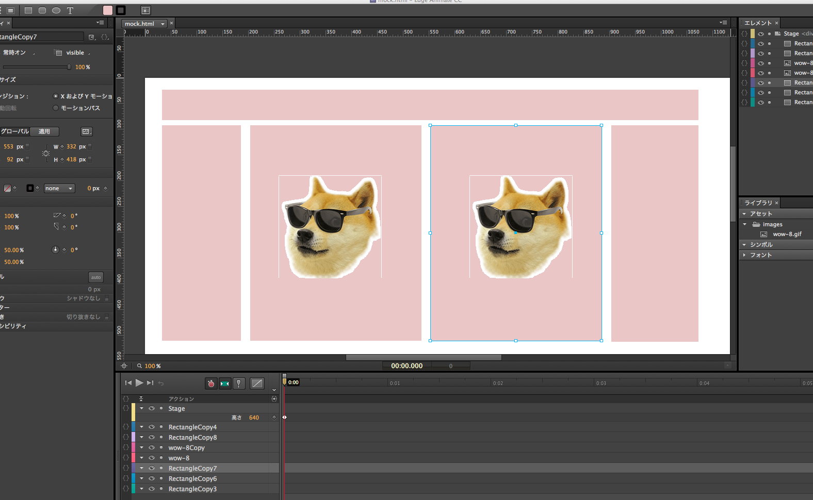
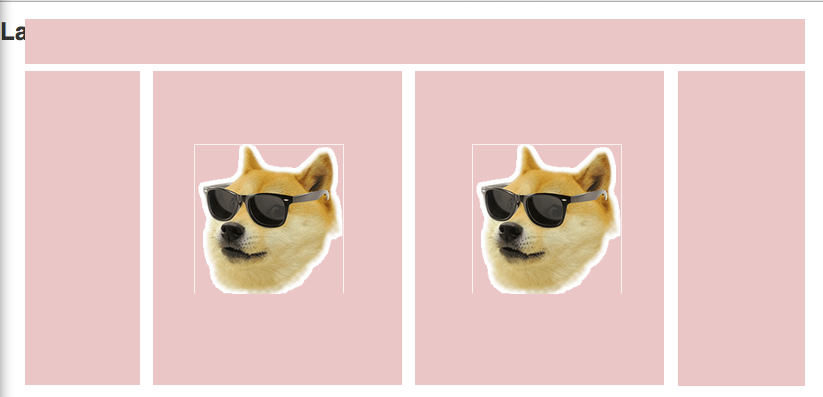

# Grunt genanimate

Grunt genanimate is static file generation task from Adobe Edge Animate project.
See also mizchi/genanimate




## How to install

```
npm install grunt-genanimate
```

## Add task to gruntfile

```
module.exports = (grunt)->
  grunt.loadNpmTasks "grunt-genanimate"
  grunt.initConfig
    genanimate:
      options:
        animate_dir: 'app/assets/animate'
        src: ['mock']
        html_gen_path: 'app/templates'
        images_gen_path: 'app/assets/images'
```
